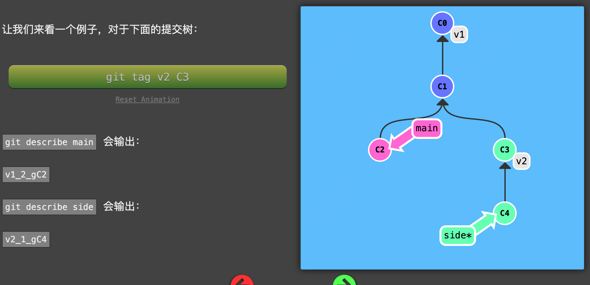
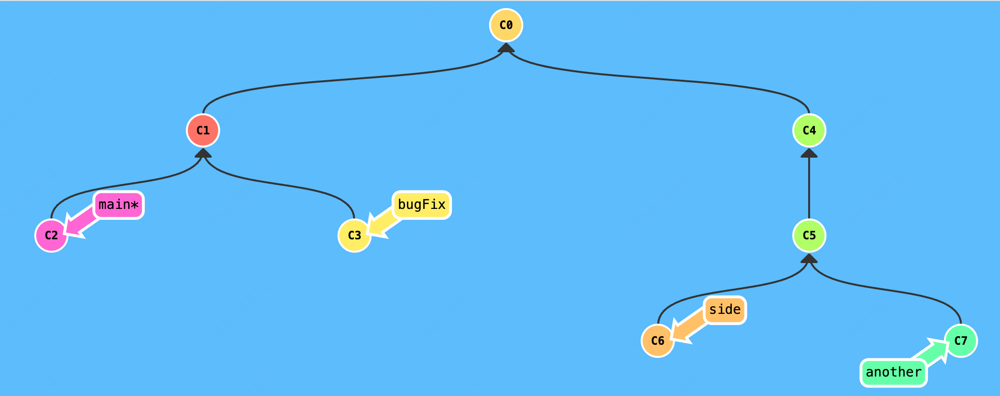

# git commit

> Git 仓库中的提交记录保存的是你的目录下所有文件的快照，就像是把整个目录复制，然后再粘贴一样，但比复制粘贴优雅许多！
>
> Git 希望提交记录尽可能地轻量，因此在你每次进行提交时，它并不会盲目地复制整个目录。条件允许的情况下，它会将当前版本与仓库中的上一个版本进行对比，并把所有的差异打包到一起作为一个提交记录。
>
> Git 还保存了提交的历史记录。这也是为什么大多数提交记录的上面都有 parent 节点的原因 —— 我们会在图示中用箭头来表示这种关系。对于项目组的成员来说，维护提交历史对大家都有好处。
>
> 关于提交记录太深入的东西咱们就不再继续探讨了，现在你可以把提交记录看作是项目的快照。提交记录非常轻量，可以快速地在这些提交记录之间切换！

执行 git commit 之后，git 会将你的修改形成一次提交，然后让当前 HEAD 指向最新的支持 commit

# git branch

> Git 的分支也非常轻量。它们只是简单地指向某个提交纪录 —— 仅此而已。所以许多 Git 爱好者传颂：
>
> ```
> 早建分支！多用分支！
> ```
>
> 这是因为即使创建再多的分支也不会造成储存或内存上的开销，并且按逻辑分解工作到不同的分支要比维护那些特别臃肿的分支简单多了。
>
> 在将分支和提交记录结合起来后，我们会看到两者如何协作。现在只要记住使用分支其实就相当于在说：“我想基于这个提交以及它所有的 parent 提交进行新的工作。”

- 创建分支

`git branch newBranch`创建一个新的分支，在新建的分支中进行 commit 提交

注意：在 Git 2.23 版本中，引入了一个名为 `git switch` 的新命令，最终会取代 `git checkout`，因为 `checkout` 作为单个命令有点超载（它承载了很多独立的功能）。 由于现在很多人还无法使用 `switch`，本次课程仍然使用 `checkout` 而不是 `switch`

也可以直接在当前分支执行`git checkout -b newBranch`这样能够快速创建一个 newBranch 的分支，同时切换到 newBranch 分支下面

# 分支与合并

> 太好了! 我们已经知道如何提交以及如何使用分支了。接下来咱们看看如何将两个分支合并到一起。就是说我们新建一个分支，在其上开发某个新功能，开发完成后再合并回主线。
>
> 咱们先来看一下第一种方法 —— `git merge`。在 Git 中合并两个分支时会产生一个特殊的提交记录，它有两个 parent 节点。翻译成自然语言相当于：“我要把这两个 parent 节点本身及它们所有的祖先都包含进来”

例如我们需要将前面的 newBranch 分支合并到 master 分支，首先我们先要在 master 分支上执行`git merge newBranch`。

# rebase 变基命令

> 第二种合并分支的方法是 `git rebase`。Rebase 实际上就是取出一系列的提交记录，“复制”它们，然后在另外一个地方逐个的放下去。
>
> Rebase 的优势就是可以创造更线性的提交历史，这听上去有些难以理解。如果只允许使用 Rebase 的话，代码库的提交历史将会变得异常清晰。
>
> 咱们还是实际操作一下吧……

例如我有一个 feat_rebase 分支，并且他的提交新于 master 分支，我们要将 rebase 上的分支内容合并到 master 上这个时候我们可以在 master 分支上执行`git rebase feat_rebase`

rebase 翻译叫做变基，他的意思就是之前 master 以最近的一次提交为基点，变基就是把 feat_rebase 中的最近一次作为基点，本质也是和 merge 一样，将 master 的地址指向到了 feat_rebase 最近的一次提交。

那他和 merge 有什么区别呢，他不会产生一次 merge 的合并 commit，同时它也能解决冲突，如果有冲突还能通过`git rebase --abort`放弃这次变基。在多人项目中还是不要去使用变基，有一个 merge 的 commit 提交记录将会更加清晰。

# HEAD 头指针

> 我们首先看一下 “HEAD”。 HEAD 是一个对当前所在分支的符号引用 —— 也就是指向你正在其基础上进行工作的提交记录。
>
> HEAD 总是指向当前分支上最近一次提交记录。大多数修改提交树的 Git 命令都是从改变 HEAD 的指向开始的。
>
> HEAD 通常情况下是指向分支名的（如 bugFix）。在你提交时，改变了 bugFix 的状态，这一变化通过 HEAD 变得可见。

HEAD 是你当前所处的提交位置，HEAD 默认指向你当前分支最近一次提交，当然我们也可以进行修改，`git checkout "commitId"`就能将 HEAD 指向另一次提交，这个时候就能查看这次 commitId 下的文件。

#

通过指定提交记录哈希值的方式在 Git 中移动不太方便。在实际应用时，并没有像本程序中这么漂亮的可视化提交树供你参考，所以你就不得不用 `git log` 来查查看提交记录的哈希值。

并且哈希值在真实的 Git 世界中也会更长（译者注：基于 SHA-1，共 40 位）。例如前一关的介绍中的提交记录的哈希值可能是 `fed2da64c0efc5293610bdd892f82a58e8cbc5d8`。舌头都快打结了吧...

比较令人欣慰的是，Git 对哈希的处理很智能。你只需要提供能够唯一标识提交记录的前几个字符即可。因此我可以仅输入`fed2` 而不是上面的一长串字符。

# 相对引用

> 通过指定提交记录哈希值的方式在 Git 中移动不太方便。在实际应用时，并没有像本程序中这么漂亮的可视化提交树供你参考，所以你就不得不用 `git log` 来查查看提交记录的哈希值。
>
> 并且哈希值在真实的 Git 世界中也会更长（译者注：基于 SHA-1，共 40 位）。例如前一关的介绍中的提交记录的哈希值可能是 `fed2da64c0efc5293610bdd892f82a58e8cbc5d8`。舌头都快打结了吧...
>
> 比较令人欣慰的是，Git 对哈希的处理很智能。你只需要提供能够唯一标识提交记录的前几个字符即可。因此我可以仅输入`fed2` 而不是上面的一长串字符。
>
> 通过指定提交记录哈希值的方式在 Git 中移动不太方便。在实际应用时，并没有像本程序中这么漂亮的可视化提交树供你参考，所以你就不得不用 `git log` 来查查看提交记录的哈希值。
>
> 并且哈希值在真实的 Git 世界中也会更长（译者注：基于 SHA-1，共 40 位）。例如前一关的介绍中的提交记录的哈希值可能是 `fed2da64c0efc5293610bdd892f82a58e8cbc5d8`。舌头都快打结了吧...
>
> 比较令人欣慰的是，Git 对哈希的处理很智能。你只需要提供能够唯一标识提交记录的前几个字符即可。因此我可以仅输入`fed2` 而不是上面的一长串字符。

通过 hash 值去切换 head 非常的麻烦，万幸我们有快捷指令

`git checkout master^` 回到上一次提交

`git checkout master~3`回到三次前的提交

也可以直接使用 HEAD，将当前指针指向进行修改`git checkout HEAD~3`

当然我们现在有交互工具比如 vscode 插件 git Graph 有非常有用，双击一次提交就能切换到那一次的提交

# 撤销变更

> 在 Git 里撤销变更的方法很多。和提交一样，撤销变更由底层部分（暂存区的独立文件或者片段）和上层部分（变更到底是通过哪种方式被撤销的）组成。我们这个应用主要关注的是后者。
>
> 主要有两种方法用来撤销变更 —— 一是 `git reset`，还有就是 `git revert`。接下来咱们逐个进行讲解。

改写历史变更，比如我们要撤销前几次的变更`git reset HEAD~2`,那这里如果是多人合作的话直接去修改 commit 的提交会导致你的分支落后于远端，提交会存在问题，那我们要如何优雅的去处上一次的提交之后依然能够分享到远程呢？

`git revert HEAD^`,git revert 会生成一次 commit 提交然后将之前的提交内容删除掉，这样你只是在整个提交树上新增了一个节点，而不是删除了一个节点

# 挑选提交

> 本系列的第一个命令是 `git cherry-pick`, 命令形式为:
>
> - `git cherry-pick <提交号>...`
>
> 如果你想将一些提交复制到当前所在的位置（`HEAD`）下面的话， Cherry-pick 是最直接的方式了。我个人非常喜欢 `cherry-pick`，因为它特别简单。
>
> 咱们还是通过例子来看一下！

比如我们要将 commit 为 c1 和 c3 的提交复制到当前分支下执行 git cherry-pick c1 c3

# 交互式变基

> 当你知道你所需要的提交记录（**并且** 还知道这些提交记录的哈希值）时, 用 cherry-pick 再好不过了 —— 没有比这更简单的方式了。
>
> 但是如果你不清楚你想要的提交记录的哈希值呢? 幸好 Git 帮你想到了这一点, 我们可以利用交互式的 rebase —— 如果你想从一系列的提交记录中找到想要的记录, 这就是最好的方法了
>
> 咱们具体来看一下……

交互式变基合并提交

`git rebase -i head~4` 对四次提交进行合并

pick 454d1ab b
s 356018a c
s 3ce9ea3 add f
s 0589cad g

交互式变基合并提交，对多余的提交进行删除

pick 454d1ab b
d 356018a c
d 3ce9ea3 add f
d 0589cad g

交互式变基可以非常好的去整理你的提交记录

# git commit --amend

`git commit --amend`可以修改上一次的提交

# git tag

`git tag v0 commitId`可以直接对某一次的提交进行打 tag，该 tag 就是一个锚点，标志着这一次的提交被稳定下来

`git checkout v0` 可以直接切换到该 tag 下

# git describe

> `git describe` 的语法是：
>
> `git describe <ref>`
>
> `<ref>` 可以是任何能被 Git 识别成提交记录的引用，如果你没有指定的话，Git 会使用你目前所在的位置（`HEAD`）。
>
> 它输出的结果是这样的：
>
> `<tag>_<numCommits>_g<hash>`
>
> `tag` 表示的是离 `ref` 最近的标签， `numCommits` 是表示这个 `ref` 与 `tag` 相差有多少个提交记录， `hash` 表示的是你所给定的 `ref` 所表示的提交记录哈希值的前几位。
>
> 当 `ref` 提交记录上有某个标签时，则只输出标签名称



# git branch -f

`git branch -f` 命令用于强制移动或更新分支指向的提交。它可以用于将分支移动到不同的提交或将分支重置到特定的提交。

```json
# 将分支 "feature" 移动到提交 "abc123"
git branch -f feature abc123
```

请注意，强制移动分支可能会导致数据丢失，因此在使用此命令时要谨慎。确保你已经备份了你的仓库，或者在使用此命令时小心谨慎.

# 多分支 rebase

> 哇，现在我们这里出现了很多分支呢！让我们把所有这些分支上所做的工作都通过 rebase 合并到 main 分支上吧。
>
> 但是你的领导给你提了点要求 —— 他们希望得到有序的提交历史，也就是我们最终的结果应该是 C6' 在 C7' 上面， C5' 在 C6' 上面，依此类推。
>
> 即使你搞砸了也没关系，用 reset 命令就可以重新开始了。记得看看我们提供的答案，看你能否使用更少的命令来完成任务！



`git checkout bugFix`

`git rebase main`

`git checkout side`

`git rebase bugFix`

`git checkout another`

`git rebase side`

`git branch -f main HEAD`

快速的合并多个分支

# git branch

git branch branchname 可以快速创建一个 branch
